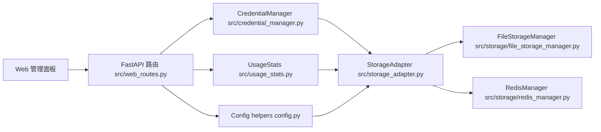

# gcli2api 项目架构说明（面向普通 CS 学生）

面向人群：有一定编程基础，但不太习惯「一坨脚本 / 小玩具项目」风格的同学。下面按「一个正常后端服务」的角度，解释整体结构与关键概念。

本文是内部结构说明文件，不会影响运行，可随仓库一起版本管理。

---

## 1. 整体定位

gcli2api 是一个「多凭证网关服务」：

- 对下：管理一堆 Google OAuth 凭证（本地文件 / Redis / 未来可扩展 DB）。
- 对上：提供统一的 HTTP / Web 控制平面和代理能力。
- 附加能力：
  - 多凭证轮询与自动切换（防止单凭证打爆）。
  - 24 小时滚动限流窗口。
  - 429 自动恢复。
  - 使用统计与简单配额视图。
  - Web 控制面板（文件管理 / 统计 / 配置 / 日志）。

可以把它理解成：一个专门为「一堆 Google 账号凭证」做的轻量级 API 网关。

---

## 2. 关键进程与入口

主要入口文件：

- [`web.py`](web.py:1)
  - 启动 FastAPI / Uvicorn，挂载控制面板和 API 路由。
- [`multi_user_auth_web.py`](multi_user_auth_web.py:1)
  - 变体入口，适配多用户 / 多项目授权。

Web 路由集中在：

- [`src/web_routes.py`](src/web_routes.py:1)
  - 所有 HTTP API（登录、上传凭证、管理凭证、使用统计、配置、日志等）。
  - 所有前端页面都走这里提供的路由。

前端页面：

- [`front/control_panel.html`](front/control_panel.html:1)
- [`front/control_panel_mobile.html`](front/control_panel_mobile.html:1)
- [`front/multi_user_auth_web.html`](front/multi_user_auth_web.html:1)

它们通过 fetch 调用 `/creds/*` `/usage/*` `/config/*` 等接口。

你可以把整体看成：

- 一个 FastAPI 应用（API + 管理面板）。
- 一层「凭证/状态/统计」存储抽象。
- 一个「凭证管理器」负责选 key、轮换、限流。
- 一个「统计模块」负责使用数据和展示周期。

---

## 3. 存储与抽象层

核心思想：所有和「凭证 / 状态 / 统计 / 配置」相关的读写，都不直接碰文件或 Redis，而是通过统一适配层。

### 3.1 Storage Adapter 总览

接口集中在：

- [`src/storage_adapter.py`](src/storage_adapter.py:1)（未在此展开，但是对下游 File/Redis/Postgres/Mongo 的统一封装）

典型提供方法（逻辑视角）：

- `store_credential(filename, data)`：保存一个凭证。
- `get_credential(filename)`：读取凭证（不含状态字段）。
- `list_credentials()`：列出所有凭证名。
- `delete_credential(filename)`：删除凭证。
- `get_credential_state(filename)` / `update_credential_state(...)`
- `get_all_credential_states()`
- `get_usage_stats(...)` / `update_usage_stats(...)`
- `get_all_usage_stats()`
- `set_config(...)` / `get_config(...)` / `get_all_config()`

上层（`CredentialManager`、`UsageStats`、HTTP 路由）只依赖这些方法，不关心底层用的是 TOML/Redis 还是别的。

### 3.2 FileStorageManager（本地文件）

实现文件：

- [`src/storage/file_storage_manager.py`](src/storage/file_storage_manager.py:60)

特点：

- 所有凭证数据放在 `creds/creds.toml` 中：
  - Key 是 `<filename.json>`。
  - Value 是「凭证字段 + 状态字段」的扁平结构。
- 使用统一缓存管理器 `UnifiedCacheManager` 做延迟写、减小 I/O。
- 负责 JSON → TOML 的迁移：
  - 老的单文件 JSON / `creds_state.toml` 会被合并进 `creds.toml`。
- 提供默认状态字段（如 `disabled` / `error_codes` 等），保证上层读取到的是完整结构。

理解方式：可以把它看作「一个小型单文件 KV 数据库」，key 是凭证名，value 是该凭证的所有信息。

### 3.3 RedisManager（远程 Redis）

实现文件：

- [`src/storage/redis_manager.py`](src/storage/redis_manager.py:71)

特点：

- 所有凭证存在单个 Hash：`gcli2api:credentials`
  - field = `filename`（如 `xxx.json`）
  - value = JSON：`{"credential": {...}, "state": {...}, "stats": {...}}`
- 配置存在 `gcli2api:config`。
- 同样通过 `UnifiedCacheManager` 做本地缓存 + 异步写回。

理解方式：这里是「结构化 KV」，用 Hash 模拟文档库，每个 field 里是这个凭证全量信息。

### 3.4 选择策略

`get_storage_adapter()` 会根据环境变量 / 运行配置选择使用：

- File 模式：适合单节点 / 本地部署。
- Redis 模式：适合多节点共享状态。
- 其他（Mongo/Postgres）：预留扩展。

上层逻辑只关心「有一个 StorageAdapter 可用」。

---

## 4. 凭证管理层：CredentialManager

实现文件：

- [`src/credential_manager.py`](src/credential_manager.py:17)

职责（可以当成一个微型「调度器」）：

1. 初始化和加载：
   - 通过 `get_storage_adapter()` 获取统一存储。
   - 扫描全部凭证文件，过滤掉：
     - `disabled == True`
     - `is_rate_limited == True`
   - 内部维护一个可用凭证列表 `_credential_files`。

2. 轮询与使用：
   - `get_valid_credential()`：
     - 根据当前索引选择凭证。
     - 自动加载凭证内容 + 状态。
     - 校验/刷新 token。
     - 如果当前凭证失效，自动标记禁用并切到下一个。
   - 支持 `calls_per_rotation` 配置：到达次数后轮换。

3. 24 小时滚动窗口限流：
   - 每个凭证有：
     - `first_use_timestamp`
     - `next_reset_timestamp`
     - `is_rate_limited`
   - `_check_and_update_usage_cycle()`：
     - 如果没有周期，或当前时间超过 `next_reset_timestamp`：
       - 开一个新的 24h 窗口：`now → now+24h`。
   - `_recover_rate_limited_credentials()`：
     - 后台周期扫描：
       - 如果 `is_rate_limited == True` 且当前时间 ≥ `next_reset_timestamp`：
         - 自动解除限流，开启新窗口。
   - `mark_rate_limited()`：
     - 被 429 等错误触发时设置 `is_rate_limited`，并补齐窗口信息。

4. 状态记录：
   - `record_api_call_result()` 更新 `last_success` / `error_codes` 等。
   - `get_or_fetch_user_email()` 解析 OAuth 凭证，缓存邮箱。

你可以把 `CredentialManager` 看成一个「有状态的负载均衡器 + 限流器」，背后挂着一堆凭证，负责选哪一个可以用。

---

## 5. 使用统计层：UsageStats

实现文件：

- [`src/usage_stats.py`](src/usage_stats.py:27)

核心区分两个概念（这点很重要）：

1. 真正的配额/封禁逻辑：由 `CredentialManager` 的 24h 窗口 + `is_rate_limited` 决定。
2. 展示用的「日维度统计」：给人看的、方便运营，并不一定等于 Google 真正的配额周期。

主要职责：

- 缓存每个凭证的统计信息：
  - `gemini_2_5_pro_calls`
  - `total_calls`
  - `daily_limit_*`（可配置）
  - 展示用 `next_reset_time`（非强制字段）
- 提供函数：
  - `record_successful_call(filename, model_name)`：
    - 增加计数。
    - 根据 `DAILY_RESET_HOUR` 做「展示统计日切重置」。
    - 从存储读取该凭证 state，把 `next_reset_timestamp` 带回给前端用于显示滚动周期。
  - `get_usage_stats(filename=None)`：
    - 单个 / 全部凭证的统计，自动合并当前状态。
  - `get_aggregated_stats()`：
    - 聚合总调用次数、平均值等。
    - 返回当前展示周期：
      - `display_period_start`
      - `display_period_end`
    - 日切时间来自 `DAILY_RESET_HOUR`（默认早上 6 点，可配置）。

要点：

- 这里的「日切」只控制「统计展示」和「Usage 页面的说明」，不改变 `CredentialManager` 的 24h 窗口。
- 未来可以在此基础上增加：
  - 软删除凭证的统计汇总条目。
  - 从展示中隐藏已删除凭证细项，只展示一个「已删除聚合」。

---

## 6. Web 路由与控制面板

实现文件：

- [`src/web_routes.py`](src/web_routes.py:1)

主要模块：

1. 控制面板页面路由：
   - `/` `/v1` `/auth`：
     - 返回 `control_panel.html` 或移动端版本。

2. 认证与会话：
   - `/auth/login`：面板密码登录。
   - `/auth/start` `/auth/callback` 等：OAuth 获取和存储凭证。
   - `verify_token` / `verify_password`：简单 Token / 密码校验。

3. 凭证管理 API：
   - `/auth/upload`：上传 JSON / ZIP 批量导入凭证。
   - `/creds/status`：返回所有凭证状态 + 元信息。
   - `/creds/action`：单个启用/禁用/删除。
   - `/creds/batch-action`：批量操作。
   - `/creds/download*` / `/creds/fetch-email` 等辅助接口。

4. 使用统计 API：
   - `/usage/stats`：
     - 调用 `get_usage_stats()`。
   - `/usage/aggregated`：
     - 调用 `get_aggregated_stats()`。
   - `/usage/update-limits`：
     - 更新单个凭证的 `daily_limit_*`。
   - `/usage/reset`：
     - 重置统计（单个/全部）。

5. 配置管理 API：
   - `/config/get`：
     - 汇总环境变量 + 存储配置，标出哪些被 env 锁定。
   - `/config/save`：
     - 写入存储（TOML/Redis），部分配置支持热更新。

6. 日志与监控：
   - `/auth/logs/clear` `/auth/logs/download` `/auth/logs/stream`：
     - 提供 web 面板里“实时日志”和清理功能。

前端（`front/control_panel.html`）通过这些 API 实现：

- 登录 / 认证。
- 凭证列表展示与操作（启用/禁用/删除/邮箱）。
- 使用统计展示（含展示周期）。
- 配置保存。
- 日志实时查看。

---

## 7. 软删除与「已删除汇总」设计思路（草案）

你提到的问题有两个：

1. 删除失败报「凭证文件不存在」：
   - 实际是：路由会先从存储读凭证，如读不到就直接返回 404。
   - 在多实例/Redis 下，如果列表/状态缓存和真实存储有不一致，就可能出现「看见但删不掉」的体验。
   - 调整方向（设计）：
     - 删除时使用标准化文件名（只看 key，而不是路径）。
     - 删除前只信任存储 adapter 的结果，不依赖过期的前端/缓存。
     - 失败信息更明确：区分「已不存在（视为已删）」和「底层错误」。

2. 已删除凭证的统计如何处理：
   - 建议采用「软删除 + 聚合条目」：
     - Delete 行为：
       - 从主凭证集合移除该 key。
       - 读取该 key 的统计数据，累加到一个保留条目：
         - 例如：`__deleted_aggregated__` 或 `deleted__aggregated.json`
         - 字段：`deleted_gemini_2_5_pro_calls`、`deleted_total_calls` 等。
       - 标记这个 key 已归档（不再单独出现在 `/usage/stats` 的细表）。
     - 使用统计页：
       - 主表只展示现存凭证。
       - 下面增加一个「已删除凭证汇总」模块：
         - 展示从聚合条目中读取的两组数字。
         - 提供一个「显示/隐藏」按钮。
       - 这些被删除的统计不计入主「当前在用凭证」总量，但可以从聚合中单独查看。
   - 实现上：
     - 完全可以在 `UsageStats` + `StorageAdapter` 层实现，保持 File 和 Redis 模式一致。
     - Web 路由只需要在 delete 操作中调用一个「归档统计」的 helper。

这个设计能解决：
- 删除后还想保留历史数据的问题。
- 避免在主表中看到一堆不存在的 key。
- 保证 Redis / File / 多实例下行为一致。

---

## 8. 结构小图（简化）

使用 Mermaid 描述主要组件关系：

---

## 9. 给普通 CS 学生的阅读建议

如果你想按「正常工程项目」方式理解和扩展：

1. 从上到下看：
   - 先看 [`web.py`](web.py:1) 和 [`src/web_routes.py`](src/web_routes.py:1)：理解有哪些 API。
   - 再看 [`src/credential_manager.py`](src/credential_manager.py:17)：理解凭证是怎么被选中和限流的。
   - 再看 [`src/usage_stats.py`](src/usage_stats.py:27)：理解统计和展示周期的区别。
   - 最后看 [`src/storage/file_storage_manager.py`](src/storage/file_storage_manager.py:60) / [`src/storage/redis_manager.py`](src/storage/redis_manager.py:71)：理解统一存储抽象。

2. 把它当成「带管理后台的微服务」看待：
   - 有清晰的适配层（StorageAdapter）。
   - 有明确的领域服务（CredentialManager / UsageStats）。
   - 有前后端分离的管理面板。

3. 如果要改行为：
   - 算法/策略层（轮询、429 策略、展示周期）：
     - 动在 `CredentialManager` 和 `UsageStats`。
   - 存储实现层：
     - 动在 `storage` 子目录。
   - 管理交互/体验：
     - 动在 `web_routes` 和 `front` 页面。

本文件的目标是：让你不再把这个项目当作「一坨脚本」，而是能用典型后端架构的视角，快速锁定修改点和扩展点。